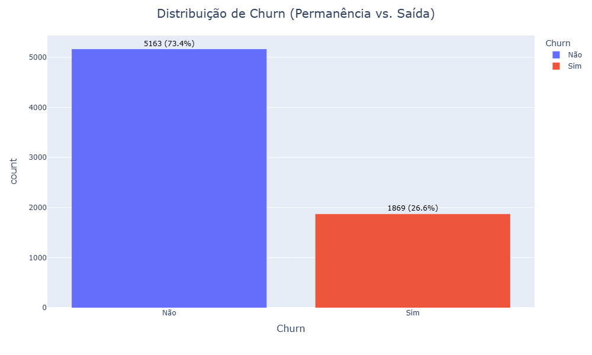
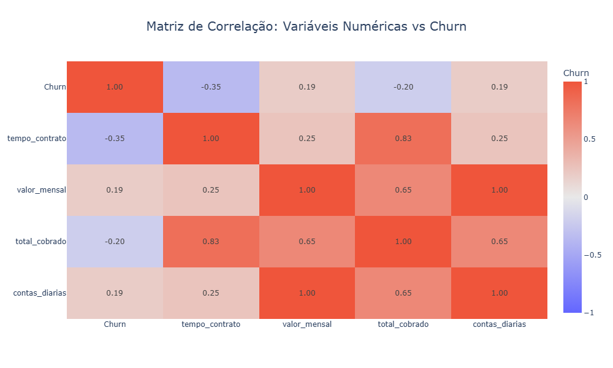
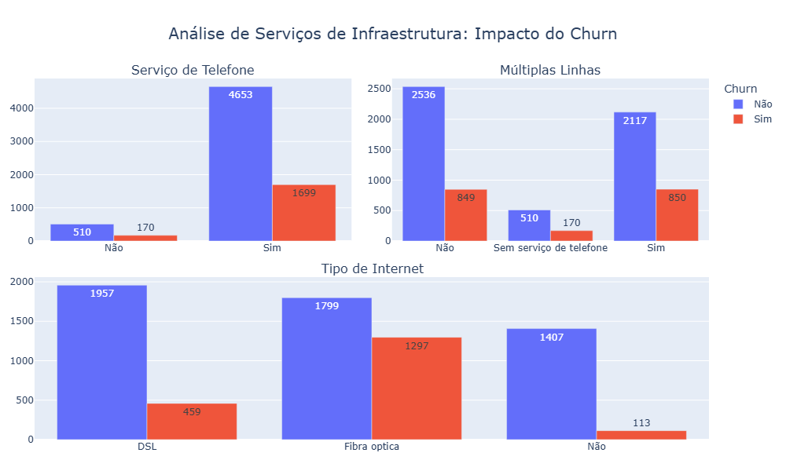
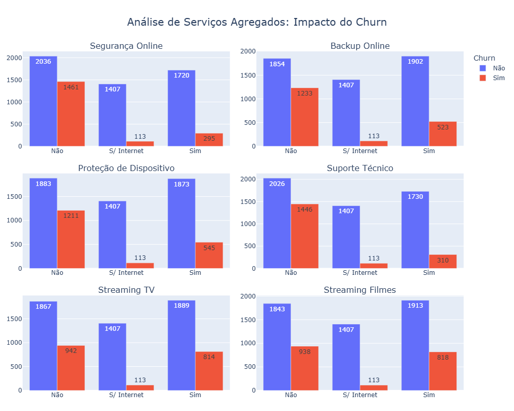
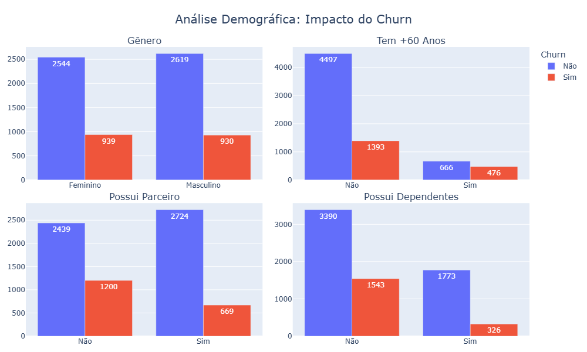
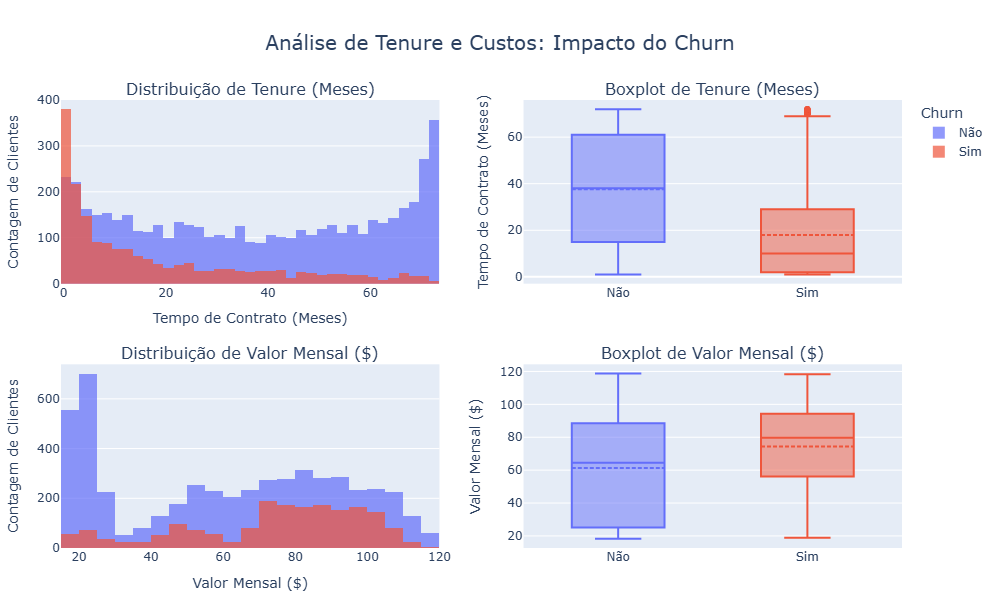
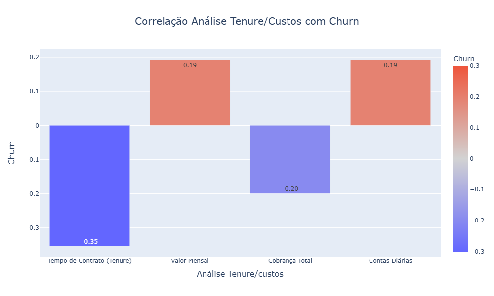

# 📈 Análise de Evasão de Clientes (Churn): Telecom X

## 📋 Sobre o Projeto
Este projeto apresenta uma análise profunda dos fatores que influenciam o **Churn** (cancelamento de serviços) na Telecom X. Através de uma abordagem de Análise Exploratória de Dados (EDA), identificamos padrões demográficos, contratuais e financeiros que permitem à empresa antecipar perdas e otimizar o Lifetime Value (LTV) da base de clientes.

---

## 🔍 **Análise da Estrutura dos Dados**
Os dados são organizados em um formato hierárquico, contendo as seguintes informações:

1. **Identificação do Cliente**  
   - `'customerID'`: Identificador único do cliente.  
   - `'Churn'`: Indica se o cliente cancelou o serviço (`Yes` ou `No`).  

2. **Informações do Cliente** (`'customer'`)  
   - `'gender'`: Gênero do cliente (`Male` ou `Female`).  
   - `'SeniorCitizen'`: Indica se o cliente é idoso (0 = Não, 1 = Sim).  
   - `'Partner'`: Se o cliente tem um parceiro(a).  
   - `'Dependents'`: Se o cliente tem dependentes.  
   - `'tenure'`: Tempo de permanência como cliente (em meses).  

3. **Serviços de Telefonia** (`'phone'`)  
   - `'PhoneService'`: Indica se o cliente possui serviço de telefone (`Yes` ou `No`).  
   - `'MultipleLines'`: Se possui múltiplas linhas telefônicas.  

4. **Serviços de Internet** (`'internet'`)  
   - Tipo de serviço de internet contratado (`DSL`, `Fiber optic`, `No`).  
   - Serviços adicionais (`OnlineSecurity`, `OnlineBackup`, `DeviceProtection`, `TechSupport`, `StreamingTV`, `StreamingMovies`).  

5. **Informações da Conta** (`'account'`)  
   - `'Contract'`: Tipo de contrato (`Month-to-month`, `One year`, `Two year`).  
   - `'PaperlessBilling'`: Se o cliente recebe faturas eletrônicas.  
   - `'PaymentMethod'`: Método de pagamento (`Bank transfer`, `Credit card`, `Electronic check`, `Mailed check`).  
   - `'Charges'`:  
     - `'Monthly'`: Valor mensal cobrado.  
     - `'Total'`: Valor total pago pelo cliente.  

---

## 📊 Galeria de Análise (Data Insights)

### 1. Visão Geral e Estrutura de Dados
A taxa de `Churn` de **26,6%** serve como nossa métrica principal. A matriz de calor revela as relações numéricas entre tempo de casa e cobranças.

| Distribuição de Churn (Baseline) | Matriz de Correlação Geral |
| :---: | :---: |
|  |  |

### 2. Infraestrutura e Serviços Agregados
Identificamos que a Fibra Óptica é um ponto de alta volatilidade, enquanto serviços de segurança retêm o cliente.

| Impacto da Tecnologia de Internet | Valor dos Serviços de Segurança/Suporte |
| :---: | :---: |
|  |  |

### 3. Perfil do Cliente e Comportamento Digital
Clientes sem dependentes e usuários de fatura digital/cheque eletrônico apresentam maior propensão à troca de operadora.

| Análise Demográfica (Dependentes/Parceiros) | Impacto da Fatura Digital e Pagamento |
| :---: | :---: |
|  |  |

### 4. Ciclo de Vida e Custos Mensais
O risco de saída é crítico no início da jornada. O valor da mensalidade (Monthly Charges) é um gatilho direto para o cancelamento.

| Distribuição de Mensalidades (Monthly Charges) | Correlação Tenure vs. Churn |
| :---: | :---: |
|  |  |

---
## 🔍 Principais Insights

* **Contratos e Fidelidade**: Contratos **Mensais** possuem a maior correlação positiva com o Churn, enquanto o modelo **Bienal** garante a maior lealdade.
* **Serviços "Âncora"**: A presença de **Suporte Técnico** e **Segurança Online** atua como uma barreira de saída; clientes sem esses serviços evadem com muito mais frequência.
* **O Risco da Fibra**: Clientes de **Fibra Óptica** apresentam maior propensão ao churn, sugerindo alta sensibilidade a preço ou forte concorrência neste segmento.
* **Zona de Risco Inicial**: O churn é extremamente concentrado nos **primeiros meses** (baixo Tenure). Clientes que ultrapassam o primeiro ano tendem a se estabilizar.
* **Meios de Pagamento**: O uso de **Cheque Eletrônico** é um forte preditor de evasão, enquanto pagamentos automáticos favorecem a retenção.

---

## 💡 Recomendações Estratégicas

1.  **Migração Contratual**: Oferecer benefícios para converter clientes de contratos mensais para planos Anuais ou Bienais.
2.  **Bundling de Utilidades**: Incluir serviços de segurança e suporte como padrão em planos de alto valor para aumentar a fidelidade.
3.  **Onboarding Intensivo**: Implementar ações de Customer Success focadas nos primeiros 6 meses de contrato para mitigar o churn precoce.
4.  **Automação Financeira**: Incentivar a migração para **Débito Automático** para reduzir o atrito e as janelas de decisão de cancelamento.

---

## 🛠️ Tecnologias Utilizadas

*  **Python**: Linguagem principal.
*  **Pandas**: Manipulação de dados.
*  **NumPy**: Cálculos numéricos.
*  **Matplotlib**: Visualizações estáticas.
*  **Seaborn**: Visualizações estatísticas refinadas.
*  **Plotly**: Dashboards interativos.
*  **Scikit-learn**: Aprendizado de máquina.
*  **Google Colab**: Ambiente de desenvolvimento.

---

## 📂 Estrutura do Repositório

* `imagens/`: Gráficos gerados para o relatório.
* `TelecomX_BR.ipynb`: Código completo e análises.
* `TelecomX_Data`: Base de dados [Dados Fictícios]
* `TelecomX_dicionario`: Estrutura dos Dados
* `Relatório_TelecomX`: Relatório HTML
---

## 🚀 Como Executar
1. Clone o repositório.
2. Instale as dependências: `pip install pandas numpy matplotlib seaborn plotly scikit-learn`.
3. Execute o arquivo `TelecomX_BR.ipynb`.

---

**Desenvolvido por:** [Wagner Bruni Batista]  
**Contato:** 